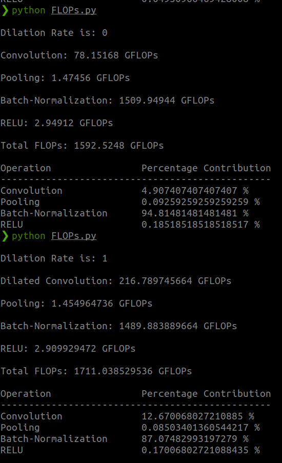

# FLOPs Calculation for a Convolution Block

[](https://opensource.org/licenses/MIT)

This repo contains the code for calculating **FLOPs (Floating-Point Operation)** for the following operations in a CNN:

- Convolution
- Dilated Convolution
- Batch-Normalization
- Pooling
- RELU Activation

## Setup

- Clone the repo:
```
https://github.com/praeclarumjj3/FLOPs-Calculation.git
```

- Run the following command to see the sample result for `batch_size = 256`:
```
python FLOPs.py
```


